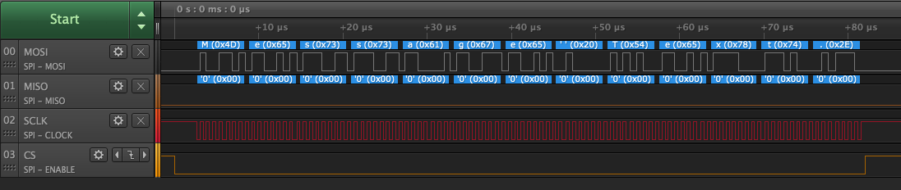

## Info

Serial Peripheral Interface (SPI) is a protocol for high speed communication over short distances.  Four signals types are defined in the protocol:

- **Master Out, Slave In (MOSI)**
- **Master In, Slave Out (MISO)**
- **Serial clock (SCLK)**
- **Chip Select (CS) sometimes called Slave Select (SS)**

SPI implements a master/slave architecture and in an embedded system the master device is normally a microcontroller with sensors or output devices acting as slaves.

Although four bus signals are defined it is not always required for all four to be used.  For instance, an output only device such as an LCD may not need to use the MISO line to send data back to the master device.

#### MOSI

Data from the master is transmitted to the slave devices on the MOSI signal line.

#### MISO

Slave devices send data to the master device using the MISO channel.

#### SCLK

The clock signal is controlled by the master device.  The short distances involved mean that high clock speeds are possible.

#### CS

SPI allows for multiple devices to be connected to the SPI bus.  The CS line allows a specific device to be selected.  It may be necessary to have more than one CS line, normally one line per device on the SPI bus.

#### Modes

SPI defines four possible modes of operation and these modes determine when the data is sampled.  As we will see later, the .NET Microframework uses arguments in the _SPI.Configuration_ object to control how the data is sampled.

The four possible modes are determined by the active state of the clock signal (high or low) and when the data is sampled (rising or falling edge of the clock).

### Netduino SPI Pins

The Netduino has a SPI interface defined on ditigal IO pins 11, 12, 13 and 4:

{:standalone}

It should be noted that the chip select pin (D4, labelled SPI - NSS) can be changed in the SPI configuration constructor.  The remaining three pins cannot be changed.

### Liquid Crystal Display (LCD)

LCDs are readily available and provide a really useful way of displaying data in your project.  Common display sizes are 16x2 and 20x4 (16x2 = 2 lines of 16 characters each).  These usually require a large number of pins to drive them.  Luckily Adafruit have a [LCD Character Backpack](https://www.adafruit.com/product/292) that can be used to drive these displays.  The board can use SPI or [I2C](/Netduino/Input_Output/Digital/I2C/), both of which reduce the number of pins required to drive the LCD.

#### Simple Write

First thing that any SPI application needs to do is to configure the SPI interface to match the characteristics of the device being used.  The following application demonstrates basic SPI setup and how to output data:

```csharp
using System.Text;
using System.Threading;
using Microsoft.SPOT.Hardware;
using SecretLabs.NETMF.Hardware.NetduinoPlus;

namespace BasicSPI
{
    public class Program
    {
        public static void Main()
        {
            SPI.Configuration spiConfig = new SPI.Configuration(
                ChipSelect_Port: Pins.GPIO_PIN_D4,      // Chip select is digital IO 4.
                ChipSelect_ActiveState: false,          // Chip select is active low.
                ChipSelect_SetupTime: 0,                // Amount of time between selection and the clock starting
                ChipSelect_HoldTime: 0,                 // Amount of time the device must be active after the data has been read.
                Clock_Edge: false,                      // Sample on the falling edge.
                Clock_IdleState: true,                  // Clock is idle when high.
                Clock_RateKHz: 2000,                    // 2MHz clock speed.
                SPI_mod: SPI_Devices.SPI1               // Use SPI1
            );

            SPI spi = new SPI(spiConfig);
            byte[] buffer = Encoding.UTF8.GetBytes("Message Text.");
            while (true)
            {
                spi.Write(buffer);
                Thread.Sleep(100);
            }
        }
    }
}
```

Note that the application used [named arguments](https://docs.microsoft.com/en-us/dotnet/csharp/programming-guide/classes-and-structs/named-and-optional-arguments) in the configuration constructor.  This help clarify the intention of the application.

Executing this application results in the following output on a logic analyzer:

{:standalone}

Zooming in on the output for one character shows the relationship between the clock and the data being transmitted:

{:standalone}

## Further Reading

- [Writing to an SPI Device](Writing)
- [Reading from an SPI Device](Reading)
- [Serial Peripheral Interface Bus](https://en.wikipedia.org/wiki/Serial_Peripheral_Interface_Bus) description
- [HD44780 LCD Interface](https://en.wikipedia.org/wiki/Hitachi_HD44780_LCD_controller) This is a common interface used to drive LCD displays.
- [Adafruit I2C/SPI Character LCD Backpack](https://www.adafruit.com/product/292)
