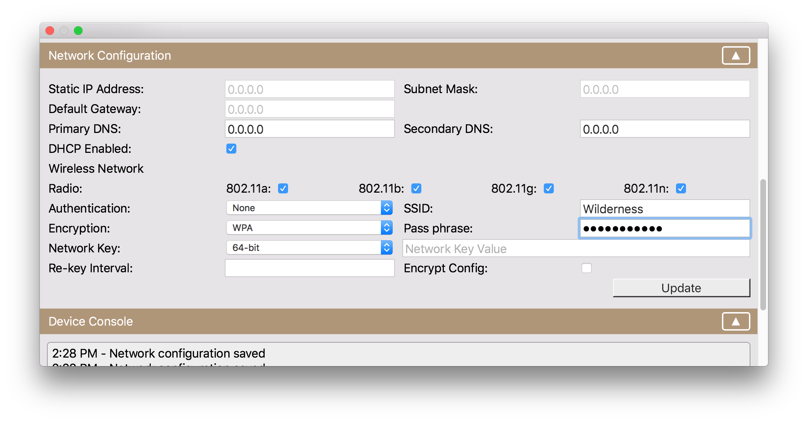

## Configuring Network Access

The first step in accessing the network from a Netduino is to configure the network settings. Settings are stored directly on the device and are configured using the Netduino.Deploy tool.

### Use Netduino.Deploy to configure network settings
Netduino.Deploy is a firmware update and network configuration tool provided by Wilderness Labs.

You can find the latest version on the [downloads page here](https://www.wildernesslabs.co/About/Downloads/).

To update your network settings:
 1. Download the latest version of Netduino.Deploy from the [downloads page](https://www.wildernesslabs.co/About/Downloads/).
 2. Hold down the button on your Netduino and connect it to your computer (this places your Netuino in bootloader mode).
 3. Launch Netduino.Deploy and ensure your device is correctly shown in the **Models** dropdown.
 4. Scroll down to the **Network Configuration** section.
 {:standalone}
 5. Configure the network settings as appropriate for your local WiFi network.
 6. Tap the `Update` button to save the changes. 

