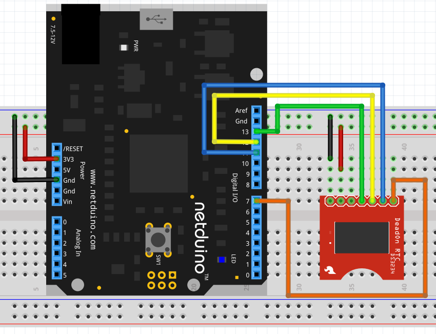

This application reads the date and time values from the [Sparkfun DeadOn RTC Breakout Board](https://www.sparkfun.com/products/10160).  This board contains the DS3234 Real Time Clock module.

## Code
```csharp
using Microsoft.SPOT;
using Microsoft.SPOT.Hardware;
using SecretLabs.NETMF.Hardware.NetduinoPlus;
using System.Threading;

namespace ReadDS3234
{
    public class Program
    {
        /// <summary>
        /// Position of the time elements in the array of bytes read from the DS3234.
        /// </summary>
        public const int REG_SECONDS = 0;
        public const int REG_MINUTE = REG_SECONDS + 1;
        public const int REG_HOUR = REG_MINUTE + 1;
        public const int REG_WEEKDAY = REG_HOUR + 1;
        public const int REG_DAY = REG_WEEKDAY + 1;
        public const int REG_DATE = REG_DAY + 1;
        public const int REG_MONTH = REG_DATE + 1;
        public const int REG_YEAR = REG_MONTH + 1;
        public const int REG_SIZE = REG_YEAR + 1;

        /// <summary>
        /// Convert the BCD byte into a a byte.
        /// </summary>
        /// <param name="value">Value to convert</param>
        /// <returns>Decimal representation of the BCD number.</returns>
        public static byte ConvertBCDToByte(byte value)
        {
            byte result;

            result = (byte) ((value & 0xf0) >> 4);
            result *= 10;
            result += (byte) (value & 0x0f);
            return (result);
        }

        /// <summary>
        /// Convert a byte value into a BCD encoded version of the data.
        /// </summary>
        /// <param name="value">Byte value to convert.</param>
        /// <returns>Byte containing the BCD representation of value.</returns>
        public static byte ConvertByteToBCD(byte value)
        {
            byte result = (byte) (value % 10);
            result |= (byte) ((value / 10) << 4);
            return (result);
        }

        /// <summary>
        /// Decode the data from the DS3234 and return a string representation of the date / time.
        /// </summary>
        /// <param name="dataFromChip">Byte array containing the date / time registers from the DS3234.</param>
        /// <returns>String representation of the date and time.</returns>
        public static string DecodeTime(byte[] dataFromChip)
        {
            byte hour, minutes, seconds, day, month;
            int year;

            seconds = ConvertBCDToByte(dataFromChip[REG_SECONDS]);
            minutes = ConvertBCDToByte(dataFromChip[REG_MINUTE]);
            if ((dataFromChip[REG_HOUR] & 0x40) > 0)
            {
                hour = ConvertBCDToByte((byte) (dataFromChip[REG_HOUR] & 0x1f));
                if ((dataFromChip[REG_HOUR] & 0x20) > 0)
                {
                    hour += 12;
                }
            }
            else
            {
                hour = ConvertBCDToByte((byte) (dataFromChip[REG_HOUR] & 0x3f));
            }
            day = ConvertBCDToByte(dataFromChip[REG_DAY]);
            month = ConvertBCDToByte((byte) (dataFromChip[REG_MONTH] & 0x7f));
            year = 1900 + ConvertBCDToByte(dataFromChip[REG_YEAR]);
            if ((dataFromChip[REG_MONTH] & 0x80) > 0)
            {
                year += 100;
            }
            return ("Current time: " + hour.ToString() + ":" + minutes.ToString() + ":" + seconds.ToString() + " Date: " + day.ToString() + "-" + month.ToString() + "-" + year.ToString());
        }

        /// <summary>
        /// Convert the data byte into a hexadecimal string representation of the number.
        /// </summary>
        /// <param name="data">Value to convert.</param>
        /// <returns>String containing the hexadecimal representation of the number.</returns>
        public static string Hexadecimal(byte data)
        {
            const string characters = "0123456789abcdef";
            string result = "0x";

            result += characters[data >> 4];
            result += characters[data & 0x0f];
            return (result);
        }

        /// <summary>
        /// Main program loop.
        /// </summary>
        public static void Main()
        {
            SPI.Configuration spiConfig = new SPI.Configuration(
                            ChipSelect_Port: Pins.GPIO_PIN_D7,      // Chip select is digital IO 7.
                            ChipSelect_ActiveState: false,          // Chip select is active low.
                            ChipSelect_SetupTime: 0,                // Amount of time between selection and the clock starting
                            ChipSelect_HoldTime: 0,                 // Amount of time the device must be active after the data has been read.
                            Clock_Edge: false,                      // Sample on the falling edge.
                            Clock_IdleState: false,                 // Clock is idle when low.
                            Clock_RateKHz: 10,                      // 10KHz clock speed.
                            SPI_mod: SPI_Devices.SPI1               // Use SPI1
                        );

            SPI spi = new SPI(spiConfig);
            int count = 0;
            while (true)
            {
                byte[] dataOut = new byte[] { 0 };
                byte[] dataIn = new byte[REG_SIZE];
                spi.WriteRead(dataOut, dataIn, 1);
                count++;
                string message = "Read " + count.ToString() + ":";
                for (int index = 0; index < dataIn.Length; index++)
                {
                    message += " " + Hexadecimal(dataIn[index]);
                }
                Debug.Print(message);
                Debug.Print(DecodeTime(dataIn));
                Thread.Sleep(2000);
            }
        }
    }
}

```

## Hardware

The DS3234 should be connected to the Netduino as follows:

{:standalone}

## [Netduino Samples Github Repository](https://github.com/WildernessLabs/Netduino_Samples)

Full source code for all of the samples can be found in the Netduino Samples repository on Github.