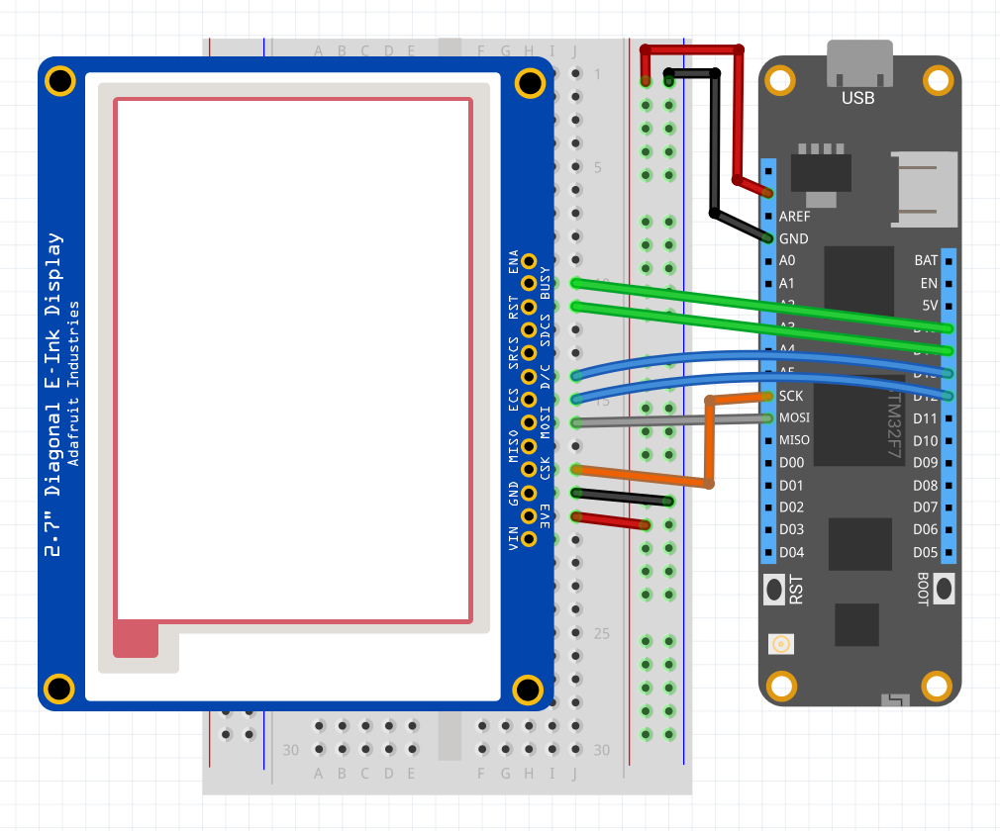

| Ssd1681 | |
|--------|--------|
| Status |  |
| Source code | [GitHub](https://github.com/WildernessLabs/Meadow.Foundation/tree/main/Source/Meadow.Foundation.Peripherals/Displays.ePaper) |
| Datasheet(s) | [GitHub](https://github.com/WildernessLabs/Meadow.Foundation/tree/main/Source/Meadow.Foundation.Peripherals/Displays.ePaper/Datasheets) |
| NuGet package | <a href="https://www.nuget.org/packages/Meadow.Foundation.Displays.ePaper/" target="_blank"></a> |

The **Ssd1681** is a two-color display controller for ePaper displays. Data is sent to the controller via SPI and supports full screen updates only.

The Ssd1681 is paired with a wide range of two color ePaper display sizes and resolutions.

[Sample projects available on GitHub](https://github.com/WildernessLabs/Meadow.Foundation/tree/main/Source/Meadow.Foundation.Peripherals/Displays.ePaper/Samples)

### Code Example

```csharp
MicroGraphics graphics;

public override Task Initialize()
{
    Resolver.Log.Info("Initialize ...");

    var display = new Ssd1681(
        spiBus: Device.CreateSpiBus(),
        chipSelectPin: Device.Pins.A04,
        dcPin: Device.Pins.A03,
        resetPin: Device.Pins.A02,
        busyPin: Device.Pins.A01,
        width: 200,
        height: 200);

    graphics = new MicroGraphics(display);

    return base.Initialize();
}

public override Task Run()
{
    Resolver.Log.Info("Run ...");

    graphics.Clear();

    graphics.DrawRectangle(10, 40, 120, 60, Color.Black, true);
    graphics.DrawRectangle(20, 80, 120, 90, Color.Red, true);

    graphics.CurrentFont = new Font12x16();
    graphics.DrawText(2, 20, "Meadow F7", Color.Black);
    graphics.DrawText(30, 50, "Color", Color.Red);
    graphics.DrawText(50, 90, "Black", Color.Black);
    graphics.DrawText(50, 120, "White", Color.White);

    graphics.Show();

    return base.Run();
}

```

[Sample project(s) available on GitHub](https://github.com/WildernessLabs/Meadow.Foundation/tree/main/Source/Meadow.Foundation.Peripherals/Displays.ePaper/Samples/SSD1681_Sample)

### Wiring Example

 To control a Ssd1681 from Meadow, connect the following:

| Ssd1681 | Meadow Pin |
|---------|------------|
| BUSY    | D15        |
| RST     | D14        |
| DC      | D13        |
| CS      | D12        |
| CLK     | SCK        |
| DIN     | MOSI       |
| GND     | GND        |
| 3V3     | 3V3        |

If your display does not include any of the above pins, they can be omitted. Pass `NULL` into the constructor for the missing pin(s).


