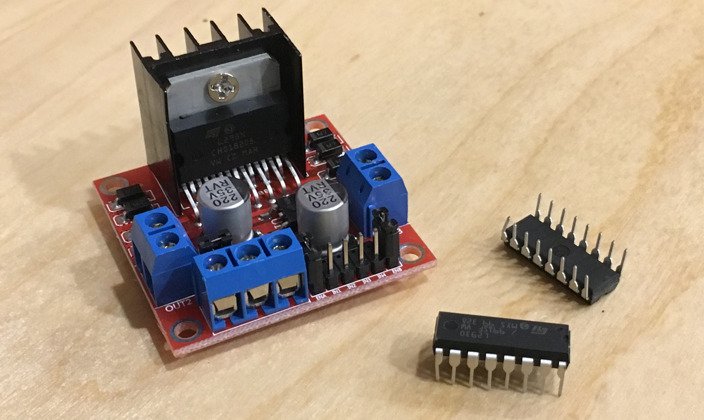

| HBridgeMotor | |
|--------|--------|
| Status |  |
| Source code | [GitHub](https://github.com/WildernessLabs/Meadow.Foundation/tree/main/Source/Meadow.Foundation.Core/Motors) |
| NuGet package | <a href="https://www.nuget.org/packages/Meadow.Foundation/" target="_blank"></a> |

An h-bridge motor controller enables a control signal to drive a much larger load in either polarity, allowing Meadow to drive DC motors in forward or reverse from an external power supply. Using pulse-width-modulation (PWM) as the control signal, provides forward or reverse control, and variable speeds in either direction.




### Code Example

```csharp
protected HBridgeMotor motor1;

public override Task Initialize()
{
    Resolver.Log.Info("Initializing...");

    motor1 = new HBridgeMotor
    (
        a1Port: Device.CreatePwmPort(Device.Pins.D07, new Frequency(100, Frequency.UnitType.Hertz)),
        a2Port: Device.CreatePwmPort(Device.Pins.D08, new Frequency(100, Frequency.UnitType.Hertz)),
        enablePort: Device.CreateDigitalOutputPort(Device.Pins.D09)
    );

    return Task.CompletedTask;
}

public override async Task Run()
{
    Resolver.Log.Info("TestMotor...");

    while (true)
    {
        // Motor Forwards
        motor1.Power = 1f;
        await Task.Delay(1000);

        // Motor Stops
        motor1.Power = 0f;
        await Task.Delay(500);

        // Motor Backwards
        motor1.Power = -1f;
        await Task.Delay(1000);
    }
}

```

[Sample project(s) available on GitHub](https://github.com/WildernessLabs/Meadow.Foundation/tree/main/Source/Meadow.Foundation.Core.Samples/Motor.HBridgeMotor_Sample)

### Wiring Example

Though h-bridge motor controllers come in various form factors, they typically share the following pins and usages:

| Motor Controller Pin           | Description                                           |
|--------------------------------|-------------------------------------------------------|
| **1,2EN** or **ENABLE A**      | Motor 1 enable. This should be configured as `enablePin` in the constructor, and it controls whether or not the motor is powered. The `HBridgeMotor` driver will automatically set this to high (enabled) when the speed is not zero. This is also enabled when `IsNeutral` is set to false, as powering the motor will cause it to brake when the speed is set to `0`. <br/><br/> On the L2N93E and SN754410 chips, this is labeled as **1,2EN**, and on the L298N, it's typically labeled as **ENABLE A**. |
| **3,4EN** or **ENABLE B**             | Motor 2 enable pin. If you are driving two motors, you'll need two `HBridgeMotor` objects, as shown in the example below. |
| **[1,2]A** or **INPUT [1,2]**  | Motor 1 control inputs. These are configured as the `a1Pin` and `a2pin` constructor parameter. These are the low-voltage control signals for motor 1 forward and reverse. <br/><br/> On the L2N93E and SN754410 chips, this is labeled as **1A** and **2A**, and on the L298N chip, it's typically labeled as **INPUT 1** and **INPUT 2**. |
| **[3,4]A** or **INPUT [3,4]**   | Motor 2 control inputs.                              |
| **GROUND** or **GND**           | Common/ground. Both the motor power supply and the logic power supply should be tied together on the same common ground plane. |
| **V<sub>CC2</sub>**, **+12V**, or **V<sub>s</sub>** | This is the positive voltage supply that drives the motors. Depending on the chip used, this may be anywhere from `4.5V` up to `50V`. |
| **V<sub>CC1</sub>**, **+5V**, or **V<sub>SS</sub>** | This is the logic voltage supply that powers the chip logic. This should be tied into the `5V` voltage pin on the Meadow.    |

The following breadboard diagram illustrates connecting two motors to an h-bridge chip that uses a external power supply to drive the motors:


